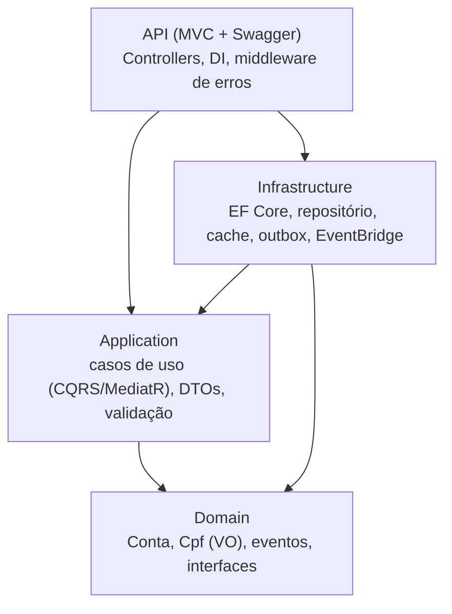
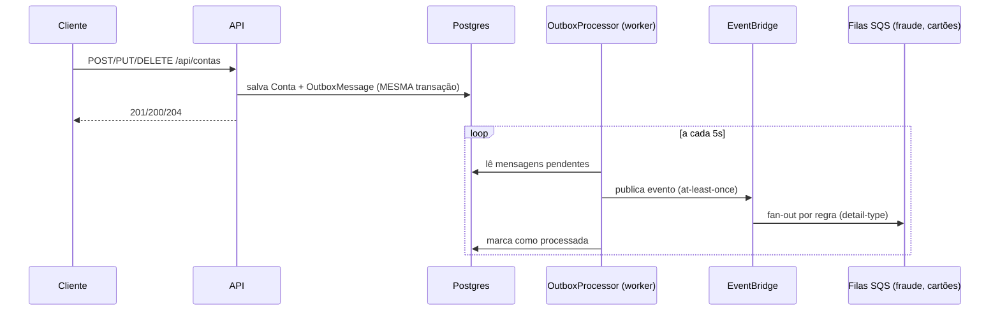
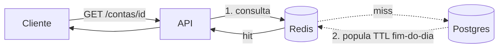

# KRT Onboarding — API de Contas

[](https://github.com/Beto052001/teste-tecnico-krt-onboarding/actions/workflows/ci.yml)
[](https://dotnet.microsoft.com/)

API de gerenciamento de contas de clientes (time de Onboarding do banco **KRT**). Teste
técnico de backend em **.NET 8** com foco em boas práticas: **Clean Architecture, DDD,
SOLID, MVC** e testes automatizados (incluindo integração com Postgres e Redis reais).

O enunciado tem três blocos. O CRUD é a parte fácil; o que o teste de fato avalia são os
**dois desafios arquiteturais** — e eles têm uma seção dedicada logo abaixo.

---

## TL;DR — as duas respostas que o desafio pede

### 1. "Várias áreas (fraude, cartões, …) precisam saber quando uma conta muda"
**Arquitetura orientada a eventos com entrega confiável (Transactional Outbox → EventBridge).**
A API **não** chama nenhuma área via HTTP — isso acoplaria e derrubaria a disponibilidade.
Em vez disso:

1. O caso de uso salva a `Conta` **e** grava o evento (`ContaCriada` / `ContaAtualizada` /
   `ContaRemovida`) na tabela `outbox_messages` **na mesma transação** — isso resolve o
   problema de *dual-write* (nunca publica sem ter persistido, nem persiste sem registrar
   o que publicar).
2. Um *worker* em segundo plano (`OutboxProcessor`) drena a outbox e publica no
   **Amazon EventBridge** (entrega *at-least-once*; falha → reprocessa).
3. As regras do EventBridge fazem **fan-out** para uma fila SQS por área. Cada área consome
   no seu ritmo, desacoplada — a API não conhece nenhum consumidor.

> Alternativa equivalente e mais barata, citada de propósito: **SNS → fan-out → SQS**.
> Escolhi EventBridge pelo roteamento por regra/`detail-type`.

### 2. "A AWS cobra por consulta; a mesma conta é lida várias vezes no mesmo dia"
**Cache-aside com Redis (ElastiCache) e TTL até o fim do dia.**

- `GET /api/contas/{id}` consulta o **cache primeiro**:
  - **hit** → devolve sem tocar no banco (zero custo de consulta);
  - **miss** → lê o banco, popula o cache e devolve.
- O item é cacheado com **TTL que expira à meia-noite UTC** — exatamente o "já consultada
  naquele mesmo dia" do enunciado.
- `PUT`/`DELETE` **invalidam** a chave (`conta:{id}`) para nunca servir dado velho.

> Se o banco fosse DynamoDB, a alternativa nativa seria o **DAX** (cache write-through).

Ambos os comportamentos têm **teste de integração de ponta a ponta** (ver
[Testes](#testes)).

---

## Arquitetura

Clean Architecture em 4 camadas; as dependências apontam **para dentro** (regra da
dependência). O `Domain` não conhece ninguém; `Api`/`Infrastructure` dependem de
abstrações.



### Fluxo de escrita + eventos (resposta nº 1)



### Fluxo de leitura + cache (resposta nº 2)



---

## Stack

| Necessidade | Escolha |
|---|---|
| Runtime | **.NET 8** (`net8.0`), SDK fixado em `global.json` |
| Web | ASP.NET Core MVC (Controllers) + Swagger (Swashbuckle) |
| ORM | EF Core 8 + Npgsql (PostgreSQL), migrations versionadas |
| Casos de uso | MediatR (CQRS leve) + eventos de domínio |
| Validação | FluentValidation (pipeline behavior) |
| Cache | `IDistributedCache` + Redis (`StackExchange.Redis`) |
| Mensageria | `AWSSDK.EventBridge` (LocalStack em dev) + Transactional Outbox |
| Logging | Serilog (estruturado) |
| Erros | `IExceptionHandler` + `ProblemDetails` (RFC 7807) |
| Testes | xUnit + FluentAssertions + NSubstitute + **Testcontainers** |
| CI | GitHub Actions (build + test em todo push/PR) |

---

## Como rodar

### Pré-requisitos
- [.NET SDK 8.0](https://dotnet.microsoft.com/download/dotnet/8.0)
- [Docker](https://www.docker.com/) (para Postgres, Redis e LocalStack)

### 1. Subir as dependências (Postgres + Redis + LocalStack)
```bash
docker compose up -d
```
Sobe, com nomes/portas próprios para não colidir com nada já instalado:
- **Postgres** em `localhost:55432`
- **Redis** em `localhost:56379`
- **LocalStack** (EventBridge + SQS) em `localhost:4566`, já provisionando o barramento
  `krt-onboarding-bus` e as filas `fraude-queue` e `cartoes-queue`.

### 2. Aplicar as migrations
```bash
dotnet tool restore
dotnet ef database update --project src/KRT.Onboarding.Infrastructure
```
O `dotnet ef` usa a fábrica de design-time (`OnboardingDbContextFactory`) — não precisa
subir a API. A connection string pode ser sobrescrita por `CONNECTIONSTRINGS__POSTGRES`.

### 3. Rodar a API
```bash
dotnet run --project src/KRT.Onboarding.Api
```
- Swagger: **http://localhost:5080/swagger**
- Health check: **http://localhost:5080/health**

> A API roda **mesmo sem LocalStack**: nesse caso os eventos ficam pendentes na outbox e
> são publicados quando o EventBridge ficar acessível (o worker reprocessa). O cache também
> degrada com elegância — se o Redis cair, a leitura cai para o banco em vez de quebrar.

---

## Endpoints

| Método | Rota | Descrição | Códigos |
|---|---|---|---|
| `POST` | `/api/contas` | Cria conta | 201, 400, 409 (CPF duplicado) |
| `GET` | `/api/contas/{id}` | Busca por id (passa pelo cache) | 200, 404 |
| `GET` | `/api/contas?pagina=1&tamanhoPagina=20` | Lista paginada | 200 |
| `PUT` | `/api/contas/{id}` | Atualiza titular/status (invalida cache) | 200, 400, 404 |
| `DELETE` | `/api/contas/{id}` | Remove conta (invalida cache) | 204, 404 |

### Exemplos

```bash
# Criar
curl -X POST http://localhost:5080/api/contas \
  -H "Content-Type: application/json" \
  -d '{ "nomeTitular": "Roberto Marquini", "cpf": "529.982.247-25" }'

# Buscar por id (1ª vez = banco + popula cache; 2ª vez = cache)
curl http://localhost:5080/api/contas/{id}

# Atualizar (invalida o cache da conta)
curl -X PUT http://localhost:5080/api/contas/{id} \
  -H "Content-Type: application/json" \
  -d '{ "nomeTitular": "Roberto M.", "status": "Inativa" }'
```

O CPF aceita entrada com ou sem máscara; é validado pelos dígitos verificadores e
armazenado **limpo** (só dígitos). Na saída ele aparece **formatado/mascarado**, e nunca é
logado em claro (LGPD).

### Ver o fan-out de eventos (LocalStack)
Depois de criar/atualizar uma conta, os eventos chegam às filas das áreas:
```bash
# instale o awscli-local (pip install awscli-local) ou use a aws cli apontando p/ :4566
awslocal sqs receive-message \
  --queue-url http://localhost:4566/000000000000/fraude-queue
```

---

## Testes

```bash
dotnet test
```

| Camada | O que cobre | Depende de Docker? |
|---|---|---|
| **Domínio** | Validação de CPF, criação/transições de status, emissão de eventos | não |
| **Application** | Handlers CRUD (CQRS) com repositório/cache/publisher mockados; hit/miss e invalidação | não |
| **Integração** | Postgres + Redis **reais** (Testcontainers): repositório, migrations, índice único, **outbox na mesma transação** e **cache-aside fim-a-fim** | sim |

O teste de cache-aside prova o *hit* de um jeito honesto: depois de popular o cache, ele
**apaga a linha do banco** entre as leituras — se a segunda leitura ainda devolve a conta,
foi servida do cache sem tocar no banco.

> Os testes de integração precisam de um Docker em execução. O CI (`ubuntu-latest`) já tem
> Docker, então a suíte inteira roda no GitHub Actions a cada push/PR.

---

## Estrutura do projeto

```
src/
  KRT.Onboarding.Domain          # Conta, Cpf (VO), StatusConta, eventos, IContaRepository
  KRT.Onboarding.Application      # casos de uso (CQRS/MediatR), DTOs, validação, abstrações
  KRT.Onboarding.Infrastructure   # EF Core, repositório, cache Redis, outbox + EventBridge
  KRT.Onboarding.Api              # Controllers, DI, Swagger, ProblemDetails, Serilog, health
tests/
  KRT.Onboarding.Domain.Tests
  KRT.Onboarding.Application.Tests
  KRT.Onboarding.IntegrationTests # Testcontainers (Postgres + Redis)
```

---

## Decisões de arquitetura

O raciocínio completo — com alternativas consideradas e descartadas para cada escolha
(EventBridge vs SNS+SQS, Postgres vs DynamoDB+DAX, outbox vs publicação direta) — está
documentado em **[`PLANEJAMENTO.md`](PLANEJAMENTO.md)**.
